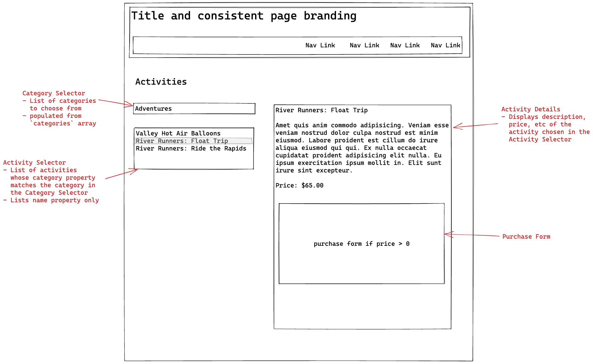

# Requirements

## Home Page (required)

- Nav links
- Images
  - Look on pexels or unsplash
- Informational text
  - Can be lorem ipsum
- (Suggested) bootstrap

## Activities Page (required)

Data comes from ./activities.js

### Requirements

- "Category Selector" - Dropdown for Types of Activities
  - When a category is selected, see a list of activities in that category
- "Activity Selector" - List box to display activity names
- "Activity Details" - Section to display activity details
  - "Purchase Form" - Form to buy e-tickets
    - Number of tickets (dropdown)
    - Credit Card number (text box)
    - Email Address (text box)
    - Purchase (submit) button
    - reset button

### Wireframe

### Approach

- [ ] HTML Page

- [ ] JS File

  - Smoke test it (`console.log('hello world')`)

- [ ] Load Categories into Category Selector

  - in HTML
    - Static code "Select One" option in HTML
  - in JS
    - Loop over categories array
    - Add each category as an \<option> to the Category Selector

- [ ] Implement Category Selector onChange Behavior

  - [ ] Write an empty event handler and smoke test onchange event
  - [ ] Get the selected category value (verify with console.log)
  - [ ] Get activities for selected category (verify with console.log)
    - **Reference**: Workbook 4 page 2-21 - Finding subsets of arrays
  - [ ] Load selected activities into activity selector
    - Loop through selected activities
    - Add a new \<option> for each activity
      - textContent is each Activity's `name` property
      - value attribute is the activity's `id` property

- [ ] Implement the Activity Selector onChange Behavior

  - [ ] Write an empty event handler and smoke test the onchange event
  - [ ] Get the selected activity value (verify with console.log)
  - [ ] Get the entire activity object based on selected activity value (verify with console.log)
    - **Reference**: Workbook 4 page 2-21 - Finding subsets of arrays

- [ ] Load selected activity into Activity Details section

  - [ ] Load activity.name into relevant HTML element
  - [ ] Load activity.description into relevant HTML element
  - [ ] Load activity.price into relevant HTML element

- [ ] Display purchase form if price > 0

  - [ ] Implement all required form elements in HTML
  - [ ] Implement purchase button
    - empty event handler with a smoke test
    - get all form values, verify with console.log
    - calculate amount (number of tickets x activity price)
    - display message in a paragraph
      - start with console.log for the message
      - insert message into HTML
  - [ ] Implement reset button
    - Resets all values back to zero or default

- Hikes (optional)
- Video (optional)
